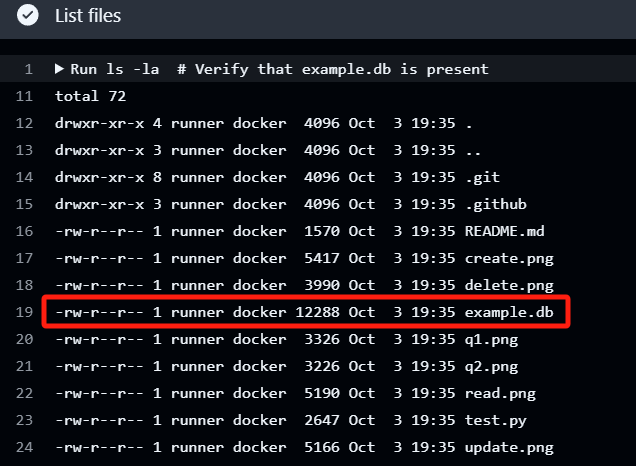
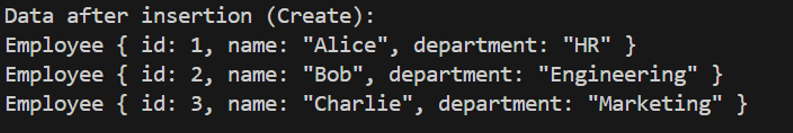
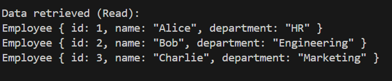
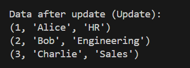
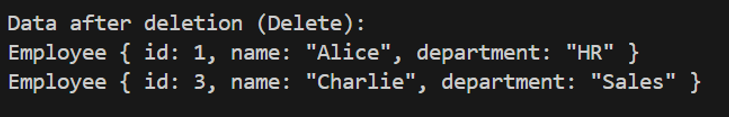
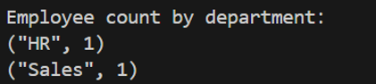

# SQL Database Interaction with Python

## Description

A Python script that connects to an SQLite database and performs CRUD operations, including custom SQL queries.

## CI/CD Pipeline
The project uses GitHub Actions to automate testing of database operations on every push. The pipeline:

Loads the existing example.db file into the environment.
Runs the script, which uses the existing database.
Verifies that each CRUD operation works correctly using assertions.
Prints the results of each operation to the pipeline logs for review.

[](https://github.com/iikikk/Python-Script-interacting-with-SQL-Database/actions/workflows/python-app.yml)

### loading the .db file

## Requirements

- Python 3.x

## Usage

1. Clone the repository.
2. Run the script:

   ```bash
   python test.py
## Database connection
Python script has successfully connected to sqlite database.


## CRUD Operations
### Create Operation
After inserting the initial data into the employees table, the data is as follows:


### Read Operation
Retrieving all data from the employees table:


### Update Operation
After updating Charlie's department to Sales, the data is:


### Delete Operation
After deleting Bob's record, the data is:


## SQL Queries
### Query 1: Employee Count by Department
Counting the number of employees in each department:


### Query 2: Employees Whose Names Start with 'A'
Selecting employees whose names start with 'A':


