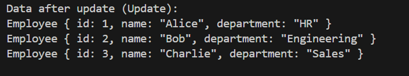

# Rust vs. Python Performance Comparison

## Description

This project focuses on rewriting a Python script for data processing into Rust to explore potential improvements in performance, specifically in execution time and memory usage. The tasks involve database operations such as creating, reading, updating, deleting data and two queries from an SQLite database.

## CI/CD Pipeline
Our CI/CD setup ensures that both Rust and Python scripts are automatically built and tested upon each commit. This process helps in maintaining high code quality and performance through continuous integration practices. The process includes test, format and lint.

[](https://github.com/iikikk/ids706_week8/actions/workflows/python-app.yml)

[](https://github.com/iikikk/ids706_week8/actions/workflows/rust.yml)

## Usage

1. Clone the repository.
2. Run the Rust Script:

   ```bash
   cargo run
3. Run the script:

   ```bash
   python test.py
## Features and Functionality
The Rust script efficiently handles database interactions with several operations:

## CRUD Operations
### Create Operation
After inserting the initial data into the employees table, the data is as follows:


### Read Operation
Retrieving all data from the employees table:


### Update Operation
After updating Charlie's department to Sales, the data is:


### Delete Operation
After deleting Bob's record, the data is:


## SQL Queries
### Query 1: Employee Count by Department
Counting the number of employees in each department:


### Query 2: Employees Whose Names Start with 'A'
Selecting employees whose names start with 'A':


## Python Implementation
The Python version performs similar database operations, enabling a direct comparison of functionality and performance between the two languages.

## Performance Comparison
### Execution Time
1. Python: 0.440 seconds

2. Rust: 0.0336 seconds

Rust demonstrates a significant improvement in execution time, being approximately 13 times faster than the Python implementation.

### Memory Usage
Memory usage was analyzed during the execution of both scripts:
1. Python: Consistent use of 31.0 MiB

2. Rust: Peaks at 39.6 MiB but generally lower during other operations

### Discussion
The Rust script not only runs faster but also manages memory more efficiently during most operations, demonstrating Rust's advantages in systems-level tasks and performance-critical applications.
This project underscores Rust's potential in handling data-intensive operations with enhanced performance. Such improvements are crucial in applications where execution speed and resource management are of paramount importance.

